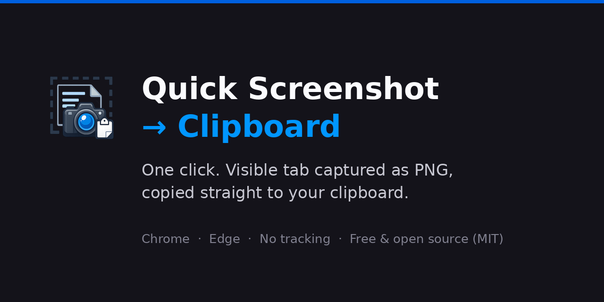

# Quick Screenshot → Clipboard

**One-click screenshot to clipboard for Chrome and Edge.** Click the icon, and the visible area of the current tab is captured as a PNG and copied straight to your clipboard — ready to paste anywhere. No editor, no file downloads, no account.

Brother extension of [Stitch Screenshot → Clipboard](https://chromewebstore.google.com/detail/stitch-screenshot-%E2%86%92-clipb/ldhpomojadcpocpghpdpinpmagjknfjh) — same philosophy (one click → clipboard), but for **full-page** captures.

## Install

| Browser | Store |
|---|---|
| Chrome | [**Chrome Web Store** →](https://chromewebstore.google.com/detail/quick-screenshot-%E2%86%92-clipbo/pimodklbppjmjnpmhaipihkfnbnldebh) |
| Edge | [**Microsoft Edge Add-ons** →](https://microsoftedge.microsoft.com/addons/detail/quick-screenshot-%E2%86%92-clipbo/ooiimcgholikdnlehogekbbfbmekinfb) |
| Firefox (desktop & Android) | [**Firefox Add-ons** →](https://addons.mozilla.org/en-US/firefox/addon/quick-screenshot-clipboard/) — separate repo: [quick-screenshot-firefox](https://github.com/OFCode-dev/quick-screenshot-firefox) |

## Why this exists

Taking a screenshot, finding the file, and dragging it into a chat is a constant micro-task. This extension collapses it to **click → paste**:

1. Click the extension icon
2. The visible part of the active tab is captured as a PNG
3. Paste with **Ctrl+V** / **Cmd+V** into Slack, ChatGPT, Docs, Notion, email, tickets — anywhere that accepts images

Perfect for bug reports, sharing snippets of pages, feeding screenshots to AI chats, and quick documentation.

## Features

- 📸 **One click** — no region selection, no editor, no extra steps
- 📋 **Straight to clipboard** — never touches your disk, no downloads folder clutter
- ⚡ **Tiny** — a few KB, Manifest V3, no dependencies
- 🔒 **Private by design** — no accounts, no tracking, no analytics, no data collection; everything runs locally
- 🆓 **Free & open source** — MIT licensed

## Permissions (all of them)

| Permission | Why |
|---|---|
| `activeTab` | Capture the visible area of the tab you're on, only when you click the icon |
| `clipboardWrite` | Put the PNG on your clipboard |

That's the full list — no host permissions, no background access to your browsing.

## Install from source (developer mode)

1. Clone this repository
2. Open `chrome://extensions` and enable **Developer mode**
3. Click **Load unpacked** and select the folder containing `manifest.json`

## FAQ

**Why doesn't it work on some pages?**
Chrome blocks screenshots on internal pages (`chrome://`, `chrome-extension://`, the Web Store) for security. Regular `https://` pages all work.

**Does it capture the full page?**
It captures the **visible area** of the tab — what you see is what you get. Full-page scrolling capture is intentionally out of scope to keep the extension tiny and permission-light.

**Where are my screenshots stored?**
Nowhere. The PNG goes to your clipboard and exists only there.

## Support

- 🐛 [Report a bug or request a feature](https://github.com/OFCode-dev/quick-screenshot-clipboard/issues)
- 📧 [contact@ofcodedev.me](mailto:contact@ofcodedev.me)
- ⭐ If this saves you time, a star helps others find it

## License

MIT — see [LICENSE](LICENSE).
